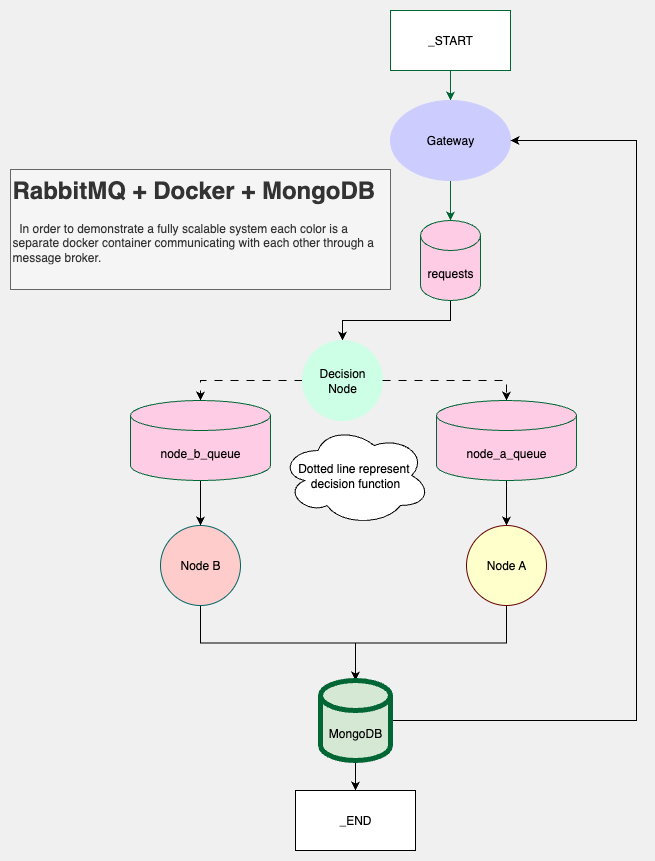

# Demo LangMQ - Distributed Message-Driven Agentic System

A scalable, distributed agentic workflow system built with RabbitMQ message queues and containerized microservices. This project demonstrates an alternative approach to monolithic agent frameworks like LangGraph, focusing on distributed processing, independent scaling, and fault isolation.



## 🏗️ Architecture Overview

This system implements a message-driven architecture where different processing nodes communicate through RabbitMQ queues:

```
HTTP Request → Gateway → Decision Node → Processing Nodes (A/B) → Storage/Output
```

### Components

- **Gateway**: FastAPI service that receives HTTP requests and publishes messages to RabbitMQ
- **Node Decision**: Intelligent router that consumes messages and routes them to appropriate processing nodes
- **Node A**: Message processor with MongoDB persistence for specific message types
- **Node B**: Alternative message processor for different message types
- **Infrastructure**: RabbitMQ (message broker) + MongoDB (persistence layer)

## 🚀 Quick Start

### Prerequisites

- Docker and Docker Compose
- Python 3.10+ (for local development)

### Running with Docker Compose

1. **Clone and navigate to the project:**
   ```bash
   git clone <repository-url>
   cd demo-langMQ
   ```

2. **Set up environment variables:**
   ```bash
   # Copy example environment files
   cp gateway/.env.example gateway/.env
   cp node_a/.env.example node_a/.env
   cp node_b/.env.example node_b/.env
   cp node_decision/.env.example node_decision/.env
   
   # Edit the .env files with your configuration
   ```

3. **Start all services:**
   ```bash
   docker-compose up -d
   ```

4. **Verify services are running:**
   ```bash
   docker-compose ps
   ```

### Services and Ports

- **Gateway API**: http://localhost:8000
- **RabbitMQ Management**: http://localhost:15672 (admin/admin)
- **MongoDB**: localhost:27017

## 📡 API Usage

### Send a Message

```bash
curl -X POST "http://localhost:8000/publish" \
     -H "Content-Type: application/json" \
     -d '{"prompt": "hello world"}'
```

Response:
```json
{
  "status": "success",
  "message": "Prompt published to queue",
  "message_id": "uuid-here"
}
```

### Retrieve Processed Message

```bash
curl "http://localhost:8000/get/{message_id}"
```

## ⚙️ Configuration

### Environment Variables

Each service uses environment variables for configuration:

#### Gateway (.env)
```bash
# RabbitMQ Configuration
RABBITMQ_HOST=rabbitmq
RABBITMQ_PORT=5672
RABBITMQ_USER=admin
RABBITMQ_PASSWORD=admin
QUEUE_NAME=hello

# MongoDB Configuration
MONGO_HOST=mongodb
MONGO_PORT=27017
MONGO_DATABASE=my_new_database
MONGO_COLLECTION=my_new_collection
```

#### Node Configuration
Similar environment files exist for each node with their specific queue and database configurations.

## 🔄 Message Flow

1. **HTTP Request** → Gateway receives POST request with prompt
2. **Message Publishing** → Gateway publishes message to 'hello' queue with unique ID
3. **Decision Routing** → Node Decision consumes message and routes based on content:
   - Messages starting with "h" → Queue 'a'
   - Other messages → Queue 'b'
4. **Processing** → Respective nodes process messages:
   - Node A: Stores in MongoDB
   - Node B: Custom processing logic
5. **Retrieval** → Gateway provides endpoint to retrieve processed results

## 🏭 Production Considerations

### Scaling

Each component can be scaled independently:

```bash
# Scale specific services
docker-compose up -d --scale node_a=3 --scale node_b=2
```

### Monitoring

- **RabbitMQ Management UI**: Monitor queue depths, message rates
- **Application Logs**: Each container outputs structured logs
- **Health Checks**: Built-in health checks for RabbitMQ

### Fault Tolerance

- **Service Restart**: All services configured with `restart: always`
- **Queue Persistence**: Messages survive RabbitMQ restarts
- **Database Persistence**: MongoDB data persisted in Docker volumes

## 🛠️ Development

### Local Development Setup

1. **Install dependencies for a specific service:**
   ```bash
   cd gateway
   pip install -e .
   ```

2. **Run services locally:**
   ```bash
   # Start infrastructure
   docker-compose up -d rabbitmq mongodb
   
   # Run gateway locally
   cd gateway
   uvicorn main:app --reload --port 8000
   ```

### Adding New Nodes

1. **Create new node directory:**
   ```bash
   mkdir node_c
   cd node_c
   ```

2. **Create required files:**
   - `config.py` - RabbitMQ and database connections
   - `main.py` - Message processing logic
   - `consume.py` - Consumer setup
   - `Dockerfile` - Container configuration
   - `pyproject.toml` - Python dependencies
   - `.env.example` - Environment template

3. **Update docker-compose.yaml:**
   ```yaml
   node_c:
     build: 
       context: ./node_c
     container_name: node_c_cnt
     restart: always
     env_file:
       - node_c/.env
     depends_on:
       rabbitmq:
         condition: service_healthy
   ```

4. **Update routing logic in node_decision/main.py**

### Extending Routing Logic

Modify `node_decision/main.py` to add new routing conditions:

```python
def callback(ch, method, properties, body):
    message_body = body.decode()
    
    # Add new routing logic
    if message_body.startswith("urgent"):
        queue = "priority_queue"
    elif message_body.startswith("h"):
        queue = "a"
    else:
        queue = "b"
    
    channel.basic_publish(
        exchange="",
        routing_key=queue,
        body=body,
        properties=pika.BasicProperties(correlation_id=message_id)
    )
```

## 🆚 Comparison with LangGraph

### Advantages of This Approach

- **Distributed Processing**: Each node runs independently, can be on different machines
- **Language Agnostic**: Nodes can be written in different programming languages
- **Independent Scaling**: Scale each node type based on workload requirements
- **Fault Isolation**: Node failures don't affect other components
- **Persistent Queues**: Messages survive system restarts
- **Backpressure Handling**: Natural load balancing through queue mechanisms

### Trade-offs

- **Network Overhead**: Inter-node communication through message broker
- **Complexity**: More infrastructure components to manage
- **State Management**: Requires careful design for stateful workflows
- **Debugging**: Distributed tracing needed for end-to-end visibility

### When to Use This Approach

- Need to scale different processing types independently
- Want to use different languages/technologies for different nodes
- Require fault isolation between components
- Have varying processing times between different node types
- Need to distribute processing across multiple machines

## 🔧 Troubleshooting

### Common Issues

1. **Services not starting**: Check Docker logs
   ```bash
   docker-compose logs <service-name>
   ```

2. **Connection refused**: Ensure RabbitMQ is healthy
   ```bash
   docker-compose ps rabbitmq
   ```

3. **Messages not processing**: Check queue status in RabbitMQ Management UI

### Debugging

- **View logs**: `docker-compose logs -f <service>`
- **Access container**: `docker exec -it <container> /bin/bash`
- **Check queues**: Visit http://localhost:15672

